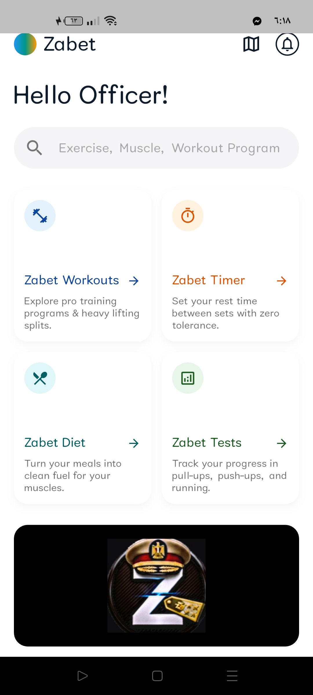
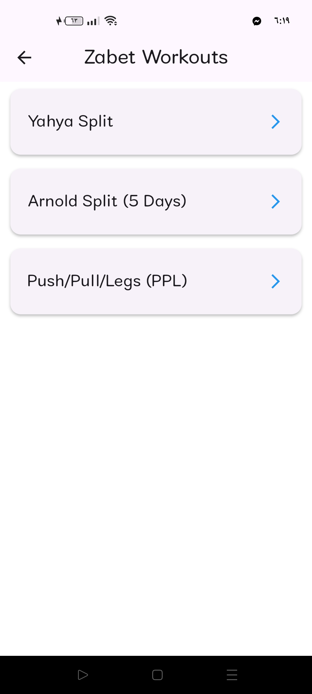
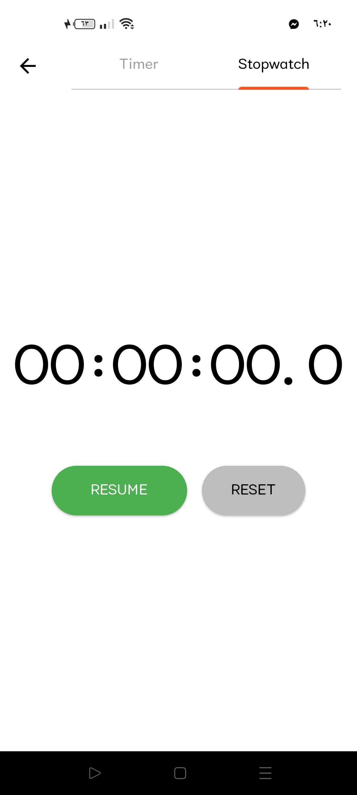
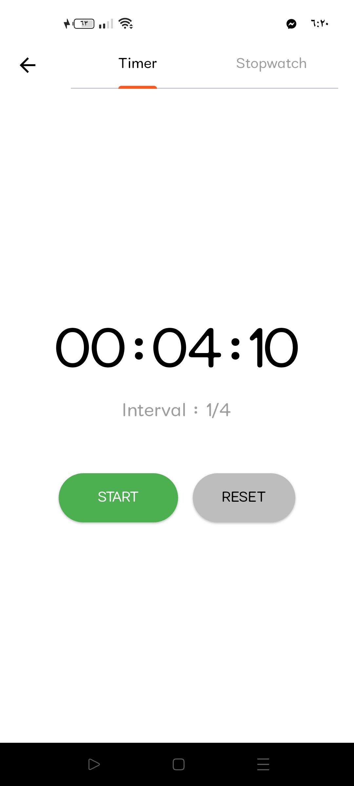
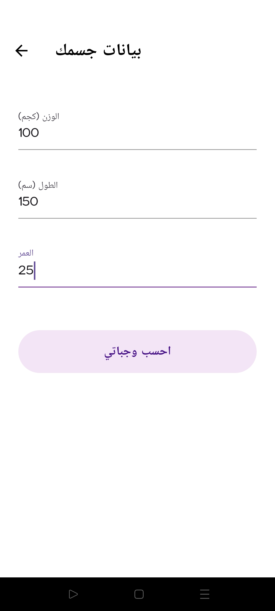
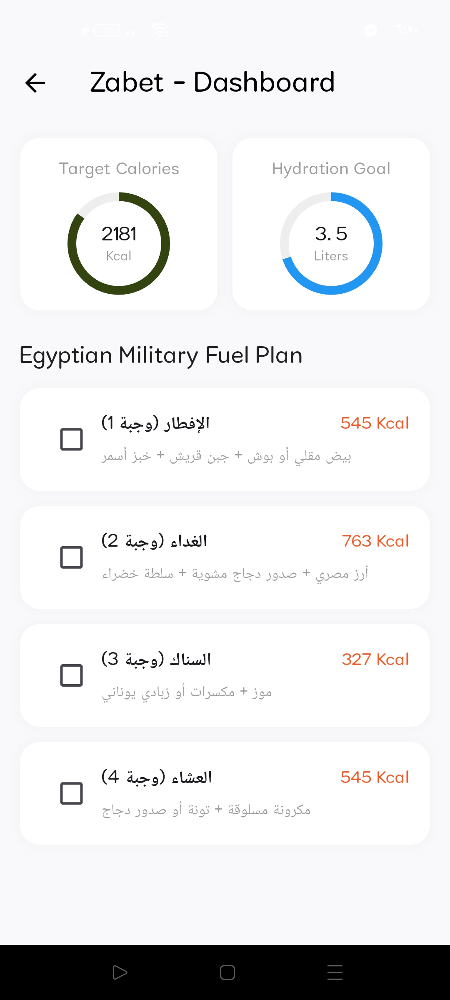
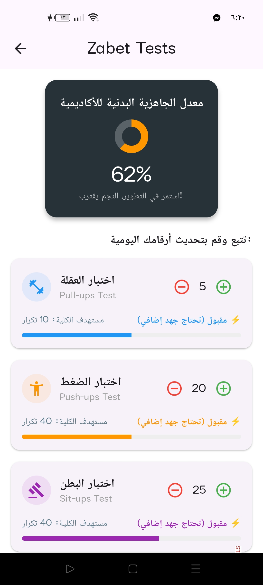

# Zabet App 🏋️‍♂️

تطبيق متخصص لمتابعة وتحسين الأداء البدني لاختبارات اللياقة للكلية العسكرية.

## 🚀 المميزات الرئيسية
*   تتبع الأداء اليومي لتمارين (العقلة، الضغط، البطن، والجري).
*   واجهة مستخدم عصرية ومريحة للعين.
*   مقارنة الأداء الحالي بالهدف المطلوب لكل تمرين.

## 🛠 التقنيات المستخدمة
*   **Framework:** Flutter
*   **Language:** Dart

## 📸 لقطات من التطبيق

|            Screen A            |            Screen B            |            Screen C            |            Screen D            |
|:------------------------------:|:------------------------------:|:------------------------------:|:------------------------------:|
|  |  |  |  |

|            Screen E            |            Screen F            |            Screen G            |
|:------------------------------:|:------------------------------:|:------------------------------:|
|  |  |  |

## whatsapp(+201553427179) 🤝 التواصل
تم تطوير هذا التطبيق بواسطة: [yahya emad]